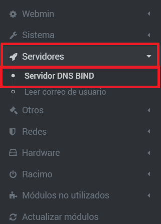
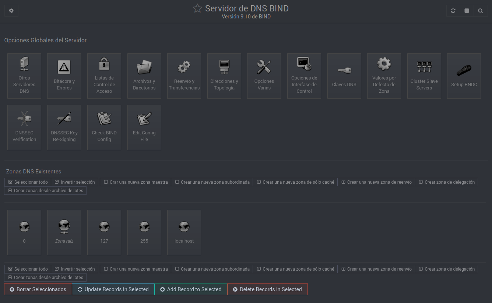

En esta página se explicará cómo instalar y comprobar que se instaló correctamente el servidor DNS BIND9 sobre UbuntuServer 16.04.5 utilizando el servicio Webmin.

## ÍNDICE
[1. Información y configuración de la máquina virtual.](Material necesario.MD)

[2. Instalación del servidor DNS usando Webmin.](Instalación y comprobación.MD)

[3. Configuración del DNS con Webmin.](README.md)

[4. Comprobación de los errores de la configuración del DNS empleando Webmin.](README.md)

# 2. INSTALACIÓN DEL SERVIDOR DNS USANDO WEBMIN.
   2.1- Para instalar el servidor DNS, debemos ir al menú "Módulos no utilizados" y accederemos al submenú "Servidor DNS BIND".
   
   
   

   2.2- Aquí simplemente le daremos a la casilla "Instalar ahora".
   
   
  
   2.3- Para ver si todo se instaló correctamente vamos nuevamente a "Servidores" y luego a "BIND DNS Server". Debe haber 16 casillas de configuración, junto a 8 subcasillas debajo de estas y 5 zonas ya creadas por defecto.
   
   
   
  

[Cliqueame para ir a: 3. Configuración del DNS con Webmin.](README.md)
