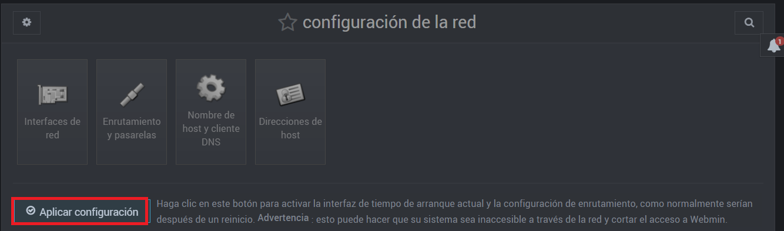

En esta página se explicará qué materiales usaremos y sus respectivas configuraciones.

## ÍNDICE

[1. Información y configuración de la máquina virtual.](Material necesario.MD)

[2. Instalación del servidor DNS usando Webmin.](Instalación y comprobación.MD)

[3. Configuración del DNS con Webmin.](README.md)

[4. Comprobación de los errores sintácticos de la configuración del DNS empleando Webmin.](README.md)

# 1. INFORMACIÓN Y CONFIGURACIÓN DE LA MÁQUINA VIRTUAL
 
__NOTA: EN CADA PASO, SE PINCHARÁ SOBRE "Salvar" o similares, no se puso en los pasos por obviedad.__

   1.2- Primero escogeremos el menú "Redes" y luego en el submenú "configuración de la red" del Webmin.
   
  
  
  1.3- Después, seleccionaremos la opción de "Interfaces de red".
  
  
   1.4- Ahora, seleccionaremos la interfaz de la red  que vamos a configurar (en mi caso, enp0s3).
   
  
  
  1.5- Luego, configuraremos la interfaz con una IP estática y máscara de red. (**OJO:** La IP debe ser la misma que hemos puesto en el DNS Preferido de nuestra máquina física (la de Windows 8.1).
  
 
  
  
   1.6 Continuamos aplicando la configuración de la interfaz.
    
   
    
  1.7- El siguiente paso, es partiendo desde el submenú "configuración de la red", vamos a entrar en el apartado "Enrutamiento y puertas de enlace".
  
  
  1.8- Posteriormente, ingresaremos la IP del gateway, en mi caso 192.168.1.1
   
  
  1.9- A continuación, partiendo desde el submenú "configuración de la red", ingresaremos en el apartado "Nombre de host y cliente DNS".
  
  

1.10- Ahora, configuramos qué tiene que hacer cuando intenta resolver un nombre a IP o viceversa, en "Servidores DNS", como su primera opción le ponemos su IP (a sí mismo) y luego un servidor DNS real, así cuando intente resolver una petición se la 'mandará' a asi mismo, si no la encuentra, entonces la manda al otro servidor DNS. También en "Orden de resolución" ponemos como 1º opción "Archivos de host" y luego, "DNS". Y por último, en "Buscar dominios", seleccionaremos "Listado.." y debajo escribiremos el nombre de nuestro dominio DNS (en mi caso lounico.local ).

  

1.11- Como penúltimo paso, aplicamos la configuración para que todo lo que hemos hecho se guarde y se aplique.

  

  1.12- Finalmente, vamos a la máquina de UbuntuServer y escribiremos el comando: ifconfig . Para comprobar que la configuración se aplicó correctamente.
  
  **NOTA:** Si no se aplicó los cambios, simplemente hay que reiniciar la máquina de UbuntuServer.
  
  
  
  
  [Hazme click para ir a: 2. Instalación del servidor DNS usando Webmin.](Instalación y comprobación.MD)
