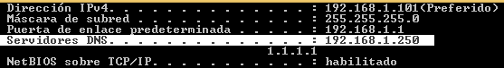
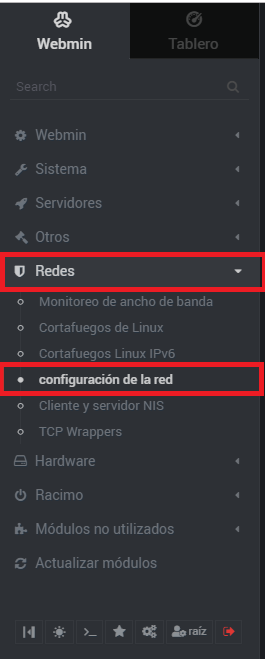
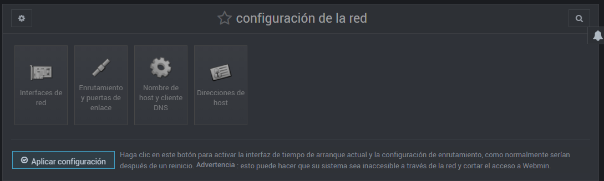
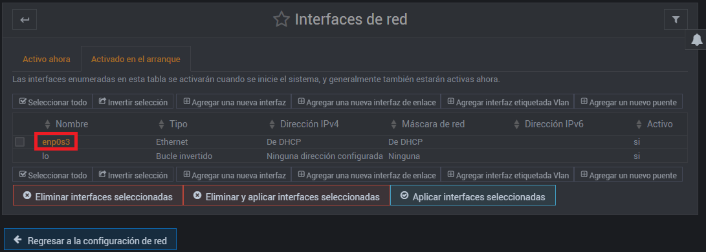
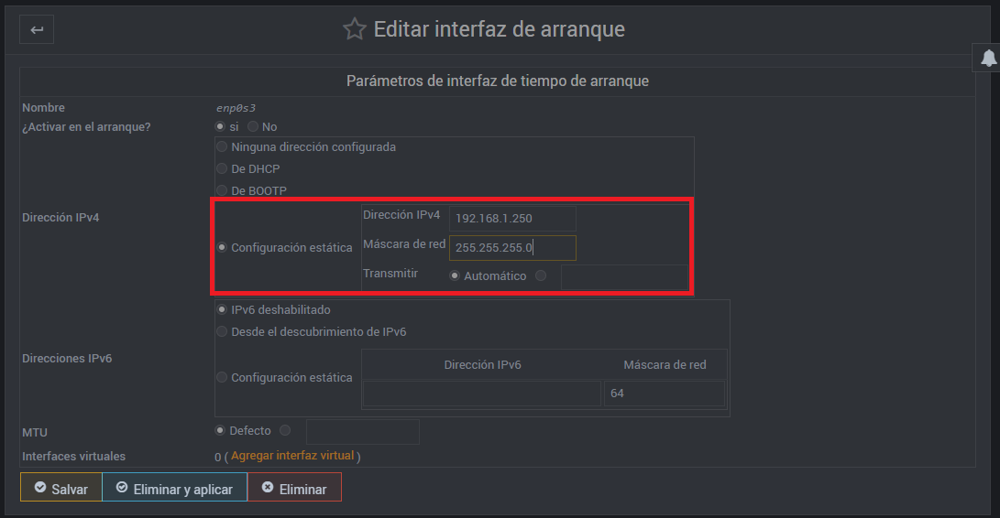
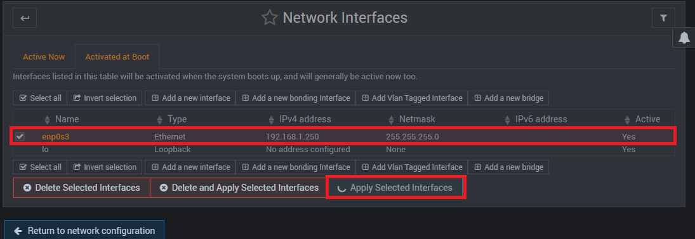
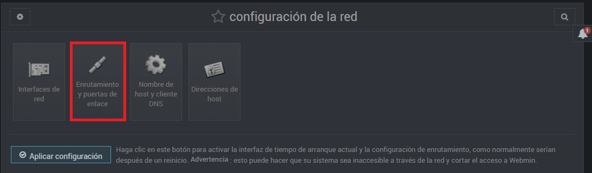
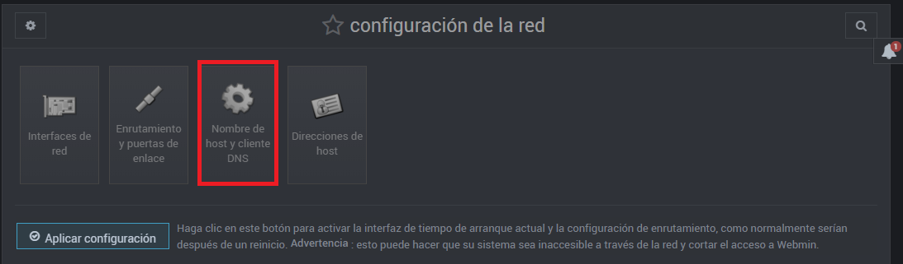
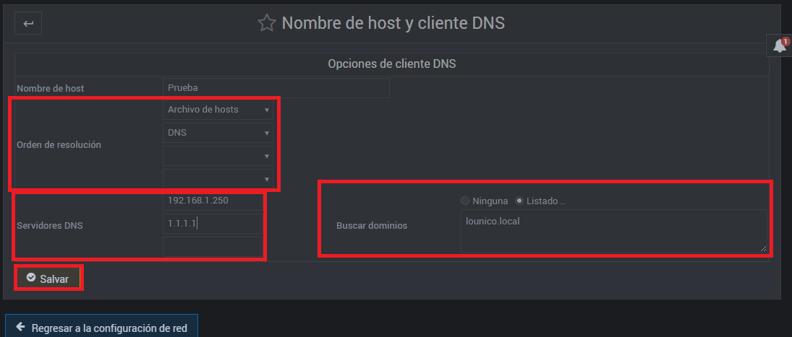
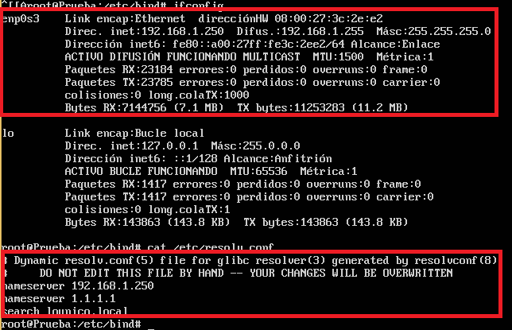

En esta página se explicará qué materiales usaremos y sus respectivas configuraciones.

## ÍNDICE

[1. Información y configuración de la(s) máquina(s) virtual(es).](Material necesario.MD)

[2. Instalación del servidor DNS usando Webmin.](Instalación y comprobación.MD)

[3. Configuración del DNS con Webmin.](README.md)

[4. Comprobación de los errores sintácticos de la configuración del DNS empleando Webmin.](README.md)

# 1. INFORMACIÓN Y CONFIGURACIÓN DE LA(S) MÁQUINA(S) VIRTUAL(ES).

Se necesitará 1 máquina virtual de UbuntuServer 16.04.1 y el sistema operativo anfitrión (u otra máquina virtual si no podemos cambiar la configuración de la red en la anfitrión, en mi caso, usaré UbuntuServer 16.04.1 y mi equipo físico Windows 8.1).

 ### *1.1.- Empezamos con la anfitrión (Windows 8.1):*

   1.1.1- En la configuración de red, pondremos IP estática, gateway, etc. pero en el "Servidor DNS preferido:" introduciremos la IP del UbuntuServer (que previamente habremos pensado y en unos pasos más adelante la pondremos en el UbuntuServer) y en el alternativo un servidor DNS real, para traducir las direcciones ajenas de la red local.
   
   
 Así primero intentará resolver el paquete con nuestro servidor, si no está la respuesta, la manda al otro DNS fuera de la LAN.
 
   
   
   1.1.2- Aplicamos cambios y comprobamos que toda la configuración de la red que hemos hecho ahora, funcione.
   
   

### *1.2.- Ahora con UbuntuServer, usaremos Webmin para configurar tanto la red, como el DNS.* 

__NOTA: EN CADA PASO, SE PINCHARÁ SOBRE "Salvar" o similares, no se puso en los pasos por obviedad.__

   1.2.1- Primero escogeremos el menú "Redes" y luego en el submenú "configuración de la red" del Webmin.
   
  
  
  1.2.2- Después, seleccionaremos la opción de "Interfaces de red".
  
  
   1.2.3- Ahora, seleccionaremos la interfaz de la red  que vamos a configurar (en mi caso, enp0s3).
   
  
  
  1.2.4- Luego, configuraremos la interfaz con una IP estática y máscara de red. (**OJO:** La IP debe ser la misma que hemos puesto en el DNS Preferido de nuestra máquina física (la de Windows 8.1).
  
 
  
  
   1.2.5 Llegando casi al último paso, aplicaremos la configuración de la interfaz.
    
   
    
  1.2.7- El siguiente paso, es partiendo desde el submenú "configuración de la red", vamos a entrar en el apartado "Enrutamiento y puertas de enlace".
  
  
  1.2.8- Posteriormente, ingresaremos la IP del gateway, en mi caso 192.168.1.1
   
  
  1.2.9- A continuación, partiendo desde el submenú "configuración de la red", ingresaremos en el apartado "Nombre de host y cliente DNS.
  
  

1.2.10- Ahora, configuramos qué tiene que hacer cuando intenta resolver un nombre a IP o viceversa, en "Servidores DNS", como su primera opción le ponemos su IP (a sí mismo) y luego un servidor DNS real, así cuando intente resolver una petición se la 'mandará' a asi mismo, si no la encuentra, entonces la manda al otro servidor DNS. También en "Orden de resolución" ponemos como 1º opción "Archivos de host" y luego, "DNS". Y por último, en "Buscar dominios", seleccionaremos "Listado.." y debajo escribiremos el nombre de nuestro dominio DNS (en mi caso lounico.local ).

  

  1.2.11- Finalmente, vamos a la máquina de UbuntuServer y escribiremos el comando: ifconfig . Para comprobar que la configuración se aplicó correctamente.
  
  
  
  
  [Hazme click para ir a: 2. Instalación del servidor DNS usando Webmin.](Instalación y comprobación.MD)
