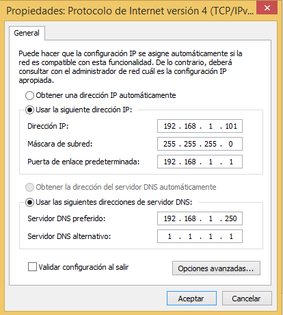

En esta página se explicará cómo instalar y configurar un servidor DNS sobre UbuntuServer 16.04.1, el servidor DNS que vamos a trabajar es Bind.

***ÍNDICE***
           
1. Información y configuración de la(s) máquina(s) vírtual(es).
2. Instalación del servidor DNS usando Webmin.
3. Configuración DNS con Webmin. 

___

**NOTA:** Antes de la configuración del servidor DNS, debemos saber ya varias cosas que son:
* Tener varios equipos configurados y activos en la red (y todos ellos con una IP estática y nombres de la máquina).
* Saber el nombre de dominio que vamos a poner al servidor DNS, junto con la IP (también estática).

_Se ponen IPs estáticas para evitar conflictos de IP._
* Disponer de 2 servicios (subdominios, como apache2 y DNS). **??**
* Tener instalado y activo el servicio [Webmin](http://www.webmin.com/deb.html).

___

**1. INFORMACIÓN Y CONFIGURACIÓN DE LA(S) MÁQUINA(S) VIRTUAL(ES).**

Se necesitará 1 máquina virtual de UbuntuServer 16.04.1 y el sistema operativo anfitrión (u otra máquina virtual si no podemos cambiar la configuración de la red en la anfitrión, en mi caso usaré UbuntuServer 16.04.1 y mi equipo físico Windows 8.1).

Empezamos con la anfitrión (Windows 8.1):

   1. En la configuración de red, pondremos IP estática, gateway, etc. pero en el ServerDNS introduciremos la IP del UbuntuServer.
   
   1. Aplicamos cambios y comprobamos que toda la configuración de la red que hemos hecho ahora, funcione.
   

**IMAGEN** 

Ahora con UbuntuServer, usaremos Webmin para configurar tanto la red, como el DNS. 
   1. Primero escogeremos el menú "
   
   1.
  
  **IMAGEN**
   1.
   
   **IMAGEN**
   1.
  
  **IMAGEN**
  
**2. INSTALACIÓN DEL SERVIDOR DNS USANDO WEBMIN.**
   1. zzzz
   **IMAGEN**
   2. mmmm
   **IMAGEN**

**3. CONFIGURACIÓN DEL DNS CON WEBMIN.**
   1. Primero, debemos entrar .
   2. qq
   3. mm
