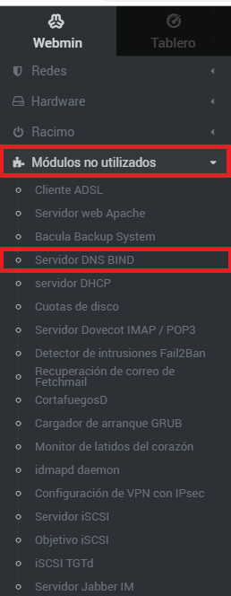
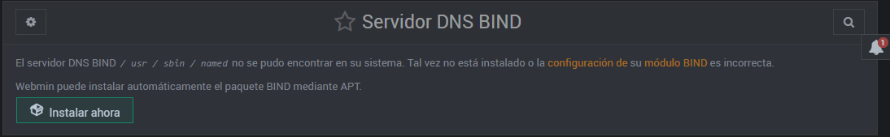
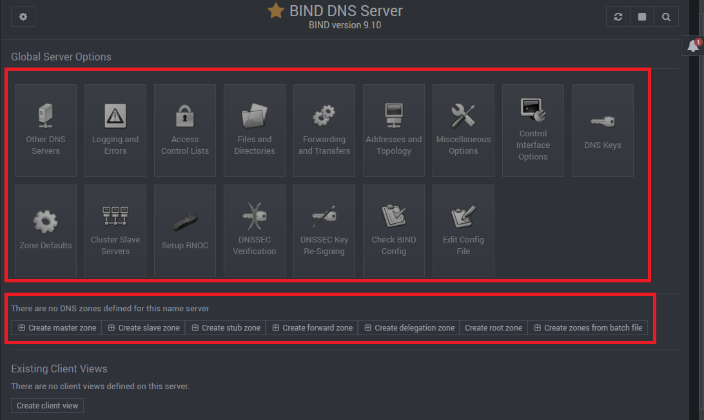

En esta página se explicará cómo instalar y configurar un servidor DNS sobre UbuntuServer 16.04.1, el servidor DNS que vamos a trabajar es Bind9.

## ÍNDICE
           
1. Información y configuración de la(s) máquina(s) vírtual(es).
2. Instalación del servidor DNS usando Webmin.
3. Configuración DNS con Webmin. 

___

**NOTA:** Antes de la configuración del servidor DNS, debemos saber ya varias cosas que son:
* Tener varios equipos configurados y activos en la red (y todos ellos con una IP estática y nombres de la máquina).
* Saber el nombre de dominio que vamos a poner al servidor DNS, junto con la IP (también estática).

_Se ponen IPs estáticas para evitar conflictos de IP._
* Disponer de 2 servicios (subdominios, como apache2 y DNS). **??**
* Tener instalado y activo el servicio [Webmin](http://www.webmin.com/deb.html).

___

## 1. INFORMACIÓN Y CONFIGURACIÓN DE LA(S) MÁQUINA(S) VIRTUAL(ES).

Se necesitará 1 máquina virtual de UbuntuServer 16.04.1 y el sistema operativo anfitrión (u otra máquina virtual si no podemos cambiar la configuración de la red en la anfitrión, en mi caso usaré UbuntuServer 16.04.1 y mi equipo físico Windows 8.1).

 1.1.- Empezamos con la anfitrión (Windows 8.1):

   1.1.1- En la configuración de red, pondremos IP estática, gateway, etc. pero en el ServerDNS introduciremos la IP del UbuntuServer y en el alternativo un servidor DNS real, para traducir las direcciones ajenas de la red local.
 
 
   
   
   1.1.2- Aplicamos cambios y comprobamos que toda la configuración de la red que hemos hecho ahora, funcione.
   
   
   

*1.2.- Ahora con UbuntuServer, usaremos Webmin para configurar tanto la red, como el DNS.* 

__NOTA: EN CADA PASO, SE PINCHARÁ SÓBRE "Salvar" o similares, no se puso en los pasos por obviedad.__

   1.2.1- Primero escogeremos el menú "Redes" y luego en el submenú "configuración de la red" del Webmin.
   
  
  
  1.2.2- Después, seleccionaremos la opción de "Interfaces de red".
  
  
   1.2.3- Ahora, seleccionaremos la interfaz de la red  que vamos a configurar (en mi caso, enp0s3).
   
  
  
  1.2.4- Luego, configuraremos la interfaz con una IP estática y máscara de red.
 
  
  
  1.2.5- El siguiente paso, es partiendo desde el submenú "configuración de la red" vamos a entrar en el apartado "Enrutamiento y puertas de enlace".
  
  
  1.2.6- Posteriormente, ingresaremos la IP del gateway, en mi caso 192.168.1.1
   
  
  1.2.7- A continuación, partiendo desde el submenú "configuración de la red", ingresaremos en el apartado "Nombre de host y cliente DNS.
  
  

1.2.8- Ahora, configuramos el servidor DNS en "Servidores DNS" como primera opción asi mismo y luego un servidor DNS real, para traducir las direcciones ajenas de la red local. También en "Orden de resolución" ponemos como 1º opción "Archivos de host" y luego, "DNS". Y por último, en "Buscar dominios", seleccionaremos "Listado.." y debajo escribiremos el nombre de nuestro dominio DNS (en mi caso lounico.local ).

  

 1.2.9 Llegando casi al último paso, aplicaremos la configuración de la interfaz.
    

  1.2.10- Finalmente, vamos a la máquina de UbuntuServer y escribiremos el comando: ifconfig . Para comprobar que la configuración se aplicó correctamente.
  
  

  
## 2. INSTALACIÓN DEL SERVIDOR DNS USANDO WEBMIN.
   2.1- Para instalar el servidor DNS, debemos ir al menú "Módulos no utilizados" y accederemos al submenú "Servidor DNS BIND".
   
   

   2.2- Aquí simplemente le daremos a la casilla "Instalar ahora".
   
  
   2.3- Para ver si todo se instaló correctamente vamos nuevamente a "Módulos no utilizados" y luego a "Servidor DNS BIND". Debe haber 16 casillas de configuración, junto a 7 subcasillas debajo de estas.
  

 
## 3. CONFIGURACIÓN DEL DNS CON WEBMIN.

   3.1- Partiendo la pantalla de configuración (del punto 2-3- Comprobar que la instalación del DNS se instaló correctamente), debemos darle a "Create master zone".
   
   

   3.2- Ahora, configuramos la zona maestra: en "Zone type" lo pondremos en 'Forward (Name to Addresses)'. Después en: "Domain name / Network" escribiremos nuestro dominio (en mi caso lounico.local). Por último nos obligará poner algo en: "Email address", podemos escribir cualquier cosa para evadirlo si no queremos poner tu correo.
 

   
  
   3.3- Una vez creado la zona maestra, podemos visualizar todas las opciones de configuración de la zona maestra, de momento le daremos a la casilla "Address(0)".
   
  

   3.4- Dentro de "Address(0)", procederemos a poner los nombres de los equipos en la variable "Name" junto con su respectiva IP privada en "Address".
   
  
   Crearemos varias más para poder probarlas más adelante.

Después de crear varias IP con los nombres, en la esquina superior derecha, nos encontraremos 2 botones; pulsaremos primero dónde dice: "Apply configuration luego en: "Apply zone", para salvar los cambios.

   
   
   3.5- Desde el menú de configuración de la zona maestra, le daremos a "Name Alias".
            
   
   3.6- Ahora procederemos con los alias o CNAME. En "Name", escribiremos el nombre del subdominio y en "Real Name" pondremos el nombre que habíamos puesto en "Name" del menú "Address" de los pasos 3-3 y 3-4, pero alfinal añadimos el dominio.
 
   
   
   Una vez finalizada la creación de CNAME, le volvemos a dar primero dónde dice: "Apply configuration" luego en: "Apply zone", para salvar los cambios.
 

   3.7- Para terminar de configurar esta zona, nos situamos en la ventana de inicio de la zona y arriba a la izquierda, estarán los 2 botones para guardar la configuración.
   
  

   3.8- A continuación, crearemos otra zona maestra, pero esta será inversa NO le seleccionamos 'Forward (Name to Addresses)', si no el otro el que dice 'Reverse (Addresses to Name)', en "Domain name / Network" escribiremos la dirección de red, pero sin la última sección (se quedará en 3 sección; 192.168.1).
 
 En "Master server", lo dejamos como está y pondremos el mismo correo electrónico en la variable "Email". 
   
  
   3.9- Posteriormente de crear la zona maestra inversa, podremos observar todas las casillas de configuración, hacemos click en "Reverse Addresses(0)".
   
   

   
   3.10- Ahora haremos justamente lo contrario al paso 3.4-, pondremos primero la dirección IP en "Address" y el nombre en "Hostname".
 
 
 Y procederemos nuevamente a salvar los cambios con las opciones: "Apply configuration" luego en: "Apply zone", para salvar los cambios.

   3.11- Y repetimos lo mismo que hemos hecho anteriormente, pero en CNAME (Name Alias).
   
   
   3.12- Por último paso, salvaremos la configuración desde el raíz del DNS (dónde hemos dado click en "create master zone".
    
   
   
  
## 4. COMPROBAR ERRORES SINTÁCTICOS EN LA CONFIGURACIÓN DNS

Para comprobar si hay errores sintácticos en las zonas maestras del servidor DNS, debemos entrar primero en la configuración deuna de las zonas maestras

_Zona Directa:__

Primero, debemos situarnos en la zona maestra directa (lounico.local) y dar clic en el botón: "Check Recorder".

   

Y como podemos ver, manda un mensaje de que no se han encontrado errores.

   

_Zona Inversa:_

Para la zona inversa, es EXACTAMENTE lo mismo que en la zona Directa, nos situamos en la zona maestra inversa (192.168.1).

  
  
  Y en la otra zona, tampoco hay errores como podemos visualizar en la siguiente fotografía.
  
  
  
  **OJO: ESTO SOLO CORRIJE SOLAMENTE ERRORES SINTÁCTICOS, SI TE EQUIVOCASTES A LA HORA DE ESCRIBIR LA IP O NOMBRE, NO TE LO DIRÁ.**
