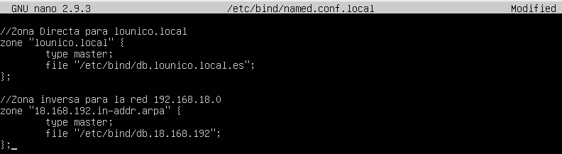

# ¿Cómo configuraremos un servidor DNS de Zonas Directas e Indirectas?

Es sencillo, usando la herramienta que hemos instalado anteriormente llamada Bind9, procederemos a su configuración:

**NOTAS:** 

**NOTA1:** Antes de realizar los pasos, es necesario saber qué nombre le vamos a dar a nuestro servidor DNS (dominio) junto a los nombres ya definidos por ejemplo:
* **IP y Nombres**
* PC1 -> 192.168.18.1
* PC2 -> 192.168.18.2
* PC3 -> 192.168.18.3
* router -> 192.168.18.100
* servidor -> 192.168.18.99

**NOTA2:** La configuración de la red debe ser estática (manual, sin DHCP), el servidor DNS tiene que estar en localhost (127.0.0.1) y luego ya los servidores DNS que vienen por defecto (1.1.1.1 o 8.8.8.8, etc).

# Seguir paso a paso las siguientes instrucciones:
1. Primero tenemos que ir al archivo /etc/nsswitch.conf y ahí eliminaremos de la línea host y el dns

2. Ahora, vamos a editar el fichero /etc/bind/named.conf.local y escribiremos nuestro nombre del domino

3.
4.
5.
6.
7.
8.
9.
10.
11.
12.
13.
14.
15.
16. Finalmente
